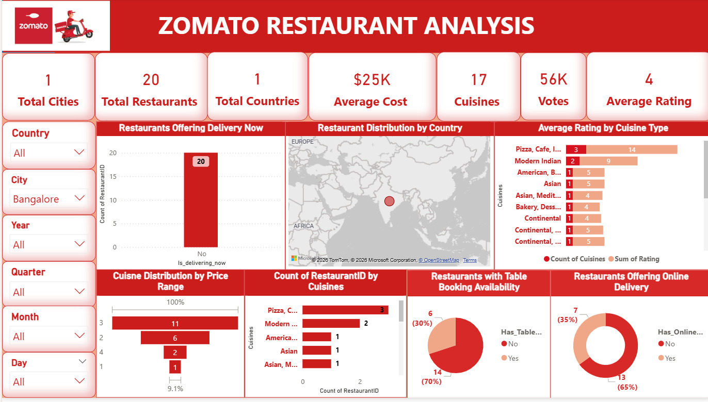

  

<h1 align="center">📊 Zomato Restaurant Analysis (Power BI Project)</h1>

# 📊 Zomato Restaurant Analysis (Power BI Project)

## 🔍 Project Overview
This project is an interactive data visualization dashboard built using **Power BI** to analyze restaurant data from Zomato. The goal is to derive meaningful insights about restaurant distribution, customer preferences, pricing, ratings, and service availability across different locations.

---

## 🎯 Objectives
- Analyze restaurant presence across cities and countries  
- Understand customer preferences based on cuisines and ratings  
- Evaluate pricing distribution and cost trends  
- Identify availability of services like online delivery and table booking  
- Provide actionable insights using interactive dashboards  

---

## 📌 Key Features & Insights  

### 🌍 Geographic Analysis
- Visualized restaurant distribution by country using map charts  
- Identified concentration of restaurants in specific cities (e.g., Bangalore)  

### 🍽️ Cuisine Analysis
- Compared average ratings by cuisine type  
- Identified most popular cuisines based on restaurant count  

### 💰 Price Analysis
- Categorized restaurants into different price ranges  
- Analyzed how pricing impacts restaurant distribution  

### ⭐ Ratings & Votes
- Tracked average ratings across restaurants  
- Analyzed total votes to measure customer engagement  

### 🚚 Service Availability
- Percentage of restaurants offering:
  - Online delivery  
  - Table booking  
- Compared service adoption trends  

---

## 📊 KPI Metrics (Top Cards)
- Total Cities  
- Total Restaurants  
- Total Countries  
- Average Cost  
- Total Cuisines  
- Total Votes  
- Average Rating  

---

## 🛠️ Tools & Technologies
- **Power BI** – Data visualization and dashboard creation  
- **Data Modeling** – Relationships, calculated columns, measures  
- **DAX (Data Analysis Expressions)** – For KPIs and aggregations  

---

## 📈 Dashboard Highlights
- Fully interactive filters (City, Country, Year, Quarter, Month, Day)  
- Dynamic charts and visuals  
- Clean UI with business-friendly insights  

---

## 🚀 Outcome
This project helps stakeholders:
- Make data-driven decisions for restaurant expansion  
- Understand customer preferences and trends  
- Improve service offerings like delivery and booking  

---

## 📎 Conclusion
The dashboard transforms raw restaurant data into meaningful insights, making it easier to analyze business performance and customer behavior in the food industry.

---

## 📬 Contact

📧 Email: budharpusrikanth77@gmail.com 
🔗 LinkedIn: https://www.linkedin.com/in/srikanth77
